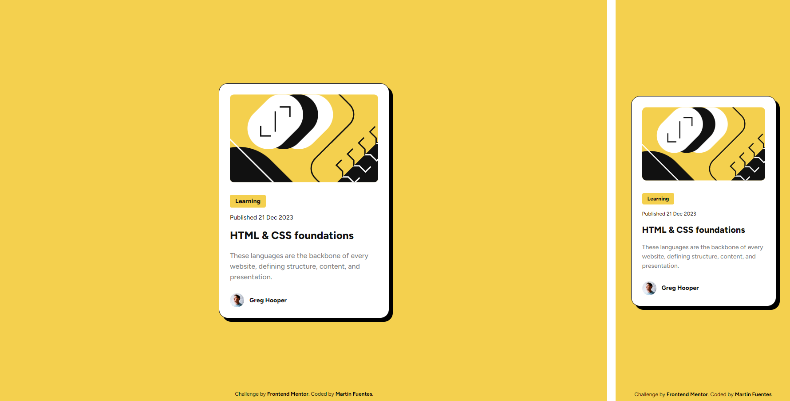

# Frontend Mentor - Blog preview card solution

This is a solution to the [Blog preview card challenge on Frontend Mentor](https://www.frontendmentor.io/challenges/blog-preview-card-ckPaj01IcS). Frontend Mentor challenges help you improve your coding skills by building realistic projects. 

## Overview

### Screenshot

### Links

- Live Site URL: [Github Page](https://cmfc31.github.io/fm-blog-preview-card/)

## My process

### Built with

- Semantic HTML5 markup
- CSS
- Flexbox

## Author

- Github - [@cmfc31](https://github.com/cmfc31)
- Frontend Mentor - [@cmfc31](https://www.frontendmentor.io/profile/cmfc31)
